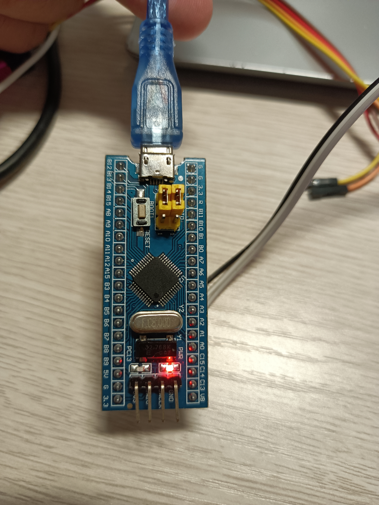

# STM32F103C8T6-LogicAnalyzer
基于STM32F103C8T6的简易逻辑分析仪，支持三通道采集；配套跨平台（Windows/Linux）Avalonia上位机软件（在另一个项目），显示波形数据。
PA0,PA1,PA2分别代表上位机的通道0，通道1，通道2，直接接USB即可与电脑通信（虚拟串口）

项目概括：
使用USB接收数据：数据包为：4字节，前面两字节为固定，0xFF,0x00，后面两字节为u16的长度数据maxPoints，表示接下来的一组采样的点数，当PA0,PA1,PA2任意一个引脚有电平跳变时，视为一次采样，一次采样记录了5字节，第一个字节，为0b11111xxx，其中前五位为标志位，后三位表示PA2,PA1,PA0的高低电平，第二到第五字节为u32的时钟计数值（DWT时钟，72Mhz），由于最大RAM的限制，采样点最多为12500/5=2500（实际上为了速度，没有在中断里判断是否越界，因此开了个13000的大数组）。
当采样点达到目标时，将会通过USB发送给上位机，因此你需要根据要采集信号的实际情况来设定采样点（不是越大越好，比如说你采集一个10hz的PWM，即每秒二十次采样，如果你设置2500采样点，那么你将在2500/20=125秒后，才能收到数据！！！）